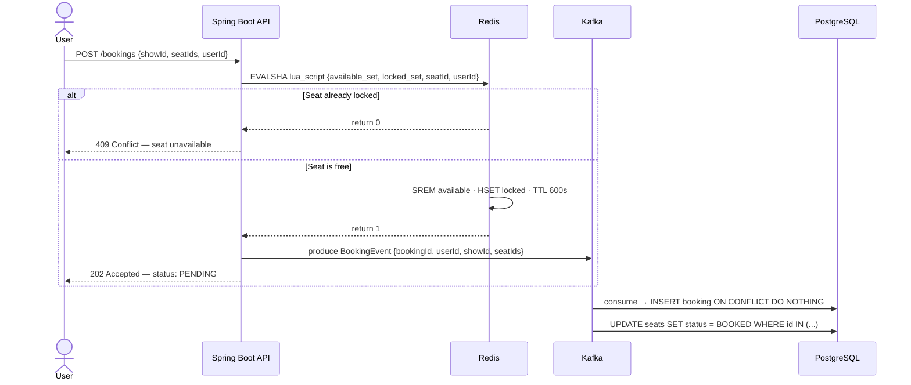

<div align="center">

<h1>Ticketizer</h1>

<p><em>High-concurrency distributed ticket booking engine — built to handle surge traffic without overselling a single seat.</em></p>

[](https://openjdk.org/projects/jdk/21/)
[](https://spring.io/projects/spring-boot)
[](https://nextjs.org)
[](https://www.postgresql.org)
[](https://redis.io)
[](https://kafka.apache.org)
[](https://www.docker.com)
[](LICENSE)

**[Live Demo](https://ticketizer-five.vercel.app)** · **[Report Bug](https://github.com/ShvetGhareWork/Ticketizer/issues)** · **[Request Feature](https://github.com/ShvetGhareWork/Ticketizer/issues)**

</div>

[](https://youtu.be/4TIaE3U9K-Q)

---

## The Problem

Most ticket booking systems collapse the moment a popular show goes live. Every user hitting "Book" at the same time causes:

- **Database deadlocks** from concurrent `SELECT FOR UPDATE` on the same seat rows
- **Overselling** when two transactions read "1 seat available" simultaneously and both commit
- **Cascade failures** as connection pools exhaust under spike traffic

Ticketizer solves this by shifting the reservation bottleneck from the database to Redis — where atomic Lua scripts make seat locks a single-threaded, sub-10ms operation — and draining writes asynchronously through Kafka.

---

## Architecture


### Request lifecycle — booking a seat



---

## Key Design Decisions

| Challenge                     | Naive Approach                     | Ticketizer's Approach                                            |
| ----------------------------- | ---------------------------------- | ---------------------------------------------------------------- |
| Concurrent seat requests      | `SELECT FOR UPDATE` on seats table | Atomic Redis Lua script — single-threaded, no DB touch           |
| Duplicate messages on retry   | At-most-once delivery              | `enable.idempotence=true` + `INSERT ... ON CONFLICT DO NOTHING`  |
| Connection pool exhaustion    | Direct DB writes on every request  | Kafka consumer drains at a controlled pace                       |
| Expired seat holds            | Polling loop                       | Redis TTL + Keyspace Notifications (`notify-keyspace-events Ex`) |
| Race between payment & expiry | Application-level check            | Optimistic locking (`@Version`) on Booking entity                |
| Poison-pill messages          | Block the partition                | Dead Letter Queue (`ticket-reservations-dlq`) + `ErrorHandler`   |

---

## Tech Stack

**Backend**

- Java 21 (virtual threads ready), Spring Boot 3.3
- Spring Data JPA + Hibernate 6, Flyway migrations
- Spring Data Redis (`StringRedisTemplate`, `ReactiveRedisTemplate`)
- Spring Kafka — idempotent producer, manual ACK consumer
- Redisson — distributed locks for payment critical sections
- Spring Security + JWT (stateless auth)
- Razorpay SDK — payment gateway integration
- Micrometer + Prometheus — metrics exposure
- Zipkin / OpenTelemetry — distributed tracing

**Frontend**

- Next.js 15 (App Router), TypeScript
- Tailwind CSS, Framer Motion
- Zustand (seat selection state), SWR (data fetching)
- `qrcode.react` — inline QR ticket generation

**Infrastructure**

- PostgreSQL 16 — source of truth
- Redis 7 — inventory layer + distributed locks
- Apache Kafka 3.6 (Confluent) — async event bus
- Docker Compose — full local stack in one command

---

## Getting Started

### Prerequisites

- Docker & Docker Compose
- Java 21+
- Node.js 18+ and npm

### 1 — Start infrastructure

```bash
docker compose up -d
```

This spins up PostgreSQL, Redis (with keyspace notifications enabled), Kafka, and Zookeeper. All services have health checks — wait until `docker compose ps` shows all as `healthy` (~30s for Kafka).

### 2 — Run the backend

```bash
# From the project root
./mvnw spring-boot:run          # Linux / macOS
.\mvnw.cmd spring-boot:run      # Windows PowerShell
```

On first boot, Flyway runs all migrations in `src/main/resources/db/migration/` and the data seeder creates a sample event with 200 seats. Backend starts at `http://localhost:8080`.

Verify it's healthy:

```bash
curl http://localhost:8080/actuator/health
```

### 3 — Run the frontend

```bash
cd frontend
npm install
npm run dev
```

Frontend runs at `http://localhost:3000`.

### 4 — Verify the schema

```bash
docker exec -it ticketflow-postgres psql -U ticketflow -d ticketflow
```

```sql
\dt
SELECT count(*) FROM seats WHERE status = 'AVAILABLE';
-- Expected: 200
```

---

## Project Structure

```
Ticketizer/
├── src/main/java/com/ticketflow/
│   ├── domain/
│   │   ├── entity/            # Event, Show, Seat, Booking + status enums
│   │   └── repository/        # JPA repositories with custom queries
│   ├── service/
│   │   ├── InventoryService   # Redis warm-up + Lua script execution
│   │   ├── BookingService     # Orchestrates lock → produce → return PENDING
│   │   └── ExpirationService  # Handles Redis keyspace expired events
│   ├── kafka/
│   │   ├── BookingProducer    # Idempotent Kafka producer
│   │   └── BookingConsumer    # Manual-ACK consumer → Postgres writer
│   ├── config/                # Redis, Kafka, Security, Redisson config
│   └── seeder/                # DataSeeder — loads test events on startup
│
├── src/main/resources/
│   ├── db/migration/
│   │   └── V1__init_schema.sql   # Tables, ENUMs, composite indexes
│   └── application.yml
│
├── frontend/
│   ├── src/app/               # Next.js App Router pages
│   │   ├── page.tsx           # Home — featured events
│   │   ├── events/[id]/       # Event detail + show selection
│   │   ├── seats/[showId]/    # Interactive seat map
│   │   ├── checkout/          # Payment form
│   │   ├── booking/[id]/      # Confirmation + QR ticket
│   │   └── my-bookings/       # Booking history
│   └── src/components/
│       ├── SeatGrid           # Live seat map (CSS grid, real-time states)
│       ├── CountdownTimer     # TTL display with expiry callback
│       ├── TicketCard         # Perforated ticket + QR code
│       └── BookingStatusBadge # Status pill component
│
├── docker-compose.yml         # Postgres + Redis + Kafka + Zookeeper
└── pom.xml
```

---

## API Reference

| Method   | Endpoint                     | Description                          |
| -------- | ---------------------------- | ------------------------------------ |
| `GET`    | `/api/events`                | List all events with pagination      |
| `GET`    | `/api/events/{id}`           | Event detail + available shows       |
| `GET`    | `/api/shows/{showId}/seats`  | Live seat map (polls every 5s)       |
| `POST`   | `/api/bookings`              | Lock seats → returns 202 PENDING     |
| `GET`    | `/api/bookings/{id}`         | Booking status (PENDING → CONFIRMED) |
| `POST`   | `/api/bookings/{id}/confirm` | Trigger payment confirmation flow    |
| `DELETE` | `/api/bookings/{id}`         | Cancel booking + release seat lock   |
| `GET`    | `/api/users/me/bookings`     | Authenticated user's booking history |

All endpoints require `Authorization: Bearer <jwt>` except `GET /api/events`.

---

## How Seat Expiry Works

When a user locks a seat, two things happen simultaneously:

1. The seat is moved from `show:{id}:available_seats` (Redis Set) to `show:{id}:locked_seats` (Redis Hash) with a **600-second TTL**
2. A `lock:seat:{seatId}` key is written to Redis with the same TTL

Redis is configured with `notify-keyspace-events Ex`. When the TTL fires, Spring Boot's `KeyExpirationEventMessageListener` catches it and:

- Checks if the booking status is still `PENDING` (not already `CONFIRMED` by payment)
- If `PENDING`: moves the seat back to the available set, marks the DB record as `EXPIRED`
- If `CONFIRMED`: no-op — the payment completed in time

---

## Local Environment Variables

Create `.env` in the project root (gitignored):

```env
# Database
DB_URL=jdbc:postgresql://localhost:5432/ticketflow
DB_USERNAME=ticketflow
DB_PASSWORD=secret

# Redis
REDIS_HOST=localhost
REDIS_PORT=6379

# Kafka
KAFKA_BOOTSTRAP_SERVERS=localhost:9092

# JWT
JWT_SECRET=your-256-bit-secret-here
JWT_EXPIRY_MS=86400000

# Razorpay
RAZORPAY_KEY_ID=rzp_test_xxxxxxxxxxxx
RAZORPAY_KEY_SECRET=your_secret_here
```

---

## Deployment & Portability

### Option A: Cloud Hosting

| Service       | Platform                       | Tier             |
| ------------- | ------------------------------ | ---------------- |
| Frontend      | [Vercel](https://vercel.com)   | Hobby (free)     |
| Backend       | [Render](https://render.com)   | Free web service |
| PostgreSQL    | [Neon](https://neon.tech)      | Free serverless  |
| Redis + Kafka | [Upstash](https://upstash.com) | Free tier        |

Connect the Render backend's environment variables to the Neon and Upstash connection strings and set `CORS_ORIGIN` to your Vercel URL.

### Option B: Portable Local Node (128GB External Drive Migration)
You can provision an external drive (`D:\`) as a self-contained, portable node containing the source code, compiled binaries, infrastructure definitions, and persistent data volumes.

```
/Ticketizer-Node
 ├── /app                  # Spring Boot source code and compiled .jar
 ├── /infrastructure       # docker-compose.yml, prometheus.yml, and data/ volumes
 └── cloudflared.exe       # Portable Cloudflare tunnel binary
```

#### 1. Spin Up Infrastructure & Observability
Navigate to the infrastructure directory and start all containers. All PostgreSQL, Redis, Kafka, Prometheus, and Grafana state files write directly to `./data` volumes on the drive:
```bash
cd D:\Ticketizer-Node\infrastructure
docker compose up -d
```

#### 2. Run the Backend & Frontend Reverse Proxy
The frontend uses a reverse proxy config in `next.config.ts` to redirect `/api/v1` traffic to the local backend on port `8080`. This eliminates CORS issues and means you only need to expose **one** public Cloudflare tunnel.

Start Spring Boot and the Next.js production server:
```bash
# Terminal 1: Backend
cd D:\Ticketizer-Node\app
java -Xmx512M -jar target/Ticketizer-0.0.1-SNAPSHOT.jar

# Terminal 2: Frontend
cd D:\Ticketizer-Node\app\frontend
npm run start
```

#### 3. Establish Public Ingress
Use the portable `cloudflared` binary on the drive to expose the frontend UI (which reverse-proxies API calls automatically):
```bash
D:\Ticketizer-Node\cloudflared.exe tunnel --url http://localhost:3000
```
This prints a single public URL (e.g. `https://xxxx.trycloudflare.com`) accessible from any browser or mobile phone.

#### 4. Monitor Metrics
- **Prometheus Scraper**: Available at `http://localhost:9090`. Checks target status.
- **Grafana Dashboards**: Available at `http://localhost:3001` (login: `admin` / `admin`). Connect data source to `http://prometheus:9090` and import dashboard ID `4701` to view live JVM metrics.

---

## Roadmap

- [x] Phase 1 — PostgreSQL schema, Flyway migrations, JPA entities, Docker Compose
- [x] Phase 2 — Redis inventory warm-up, atomic Lua seat locking
- [x] Phase 3 — Kafka idempotent producer, PENDING response pattern
- [x] Phase 4 — Consumer with manual ACK, DLQ, idempotent DB writes
- [x] Phase 5 — Seat expiration via Redis TTL + Keyspace Notifications, Redisson locks
- [x] Phase 6 — Prometheus metrics, distributed tracing, Next.js frontend
- [x] Razorpay webhook payment confirmation
- [x] JWT auth + user registration flow
- [ ] JMeter load test report (target: 50k concurrent users)
- [ ] GitHub Actions CI pipeline

---

## Contributing

Pull requests are welcome. For major changes, open an issue first.

```bash
git checkout -b feature/your-feature
git commit -m "feat: describe your change"
git push origin feature/your-feature
```

---

<div align="center">

Built by [Shvet Ghare](https://shvet.vercel.app) ·

</div>
